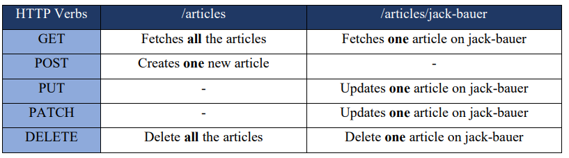

### A basic CRUD(Create - Read - Update - Delete) RESTful API
## Routing:

There are two URL end points, one is "/articles" to access all articles in database and "/articles/:articleTitle" to access a specific article inside the database.
Routing table:





## Deprecation warnings from mongoose.js:

Because MongoDB Node.js driver rewrote the tool it uses to parse MongoDB connection strings, so
you need to turn on the useNewUrlPartser to use their new tool.
And because there are many changes with mongoDB Node.js driver, there will be some tools that
won’t work anymore, and they will give deprecation warning. To turn off these warning, please check
this url: https://mongoosejs.com/docs/deprecations.html


## Testing:

I use Postman for HTTP requests and Robo3T to interact with database (You can use mongo shell).


## Re-populate Database (YOu can copy this as example data for testing in Robo3T)

```


{
    "_id" : ObjectId("5c139771d79ac8eac11e754a"),
    "title" : "API",
    "content" : "API stands for Application Programming Interface. It is a set of subroutine definitions, communication protocols, and tools for building software. In general terms, it is a set of clearly defined methods of communication among various components. A good API makes it easier to develop a computer program by providing all the building blocks, which are then put together by the programmer."
}


{
    "_id" : ObjectId("5c1398aad79ac8eac11e7561"),
    "title" : "Bootstrap",
    "content" : "This is a framework developed by Twitter that contains pre-made front-end templates for web design"
}


{
    "_id" : ObjectId("5c1398ecd79ac8eac11e7567"),
    "title" : "DOM",
    "content" : "The Document Object Model is like an API for interacting with our HTML"
}


{
    "_id" : "5c18f35cde40ab6cc551cd60",
    "title" : "Jack Bauer",
    "content" : "Jack Bauer once stepped into quicksand. The quicksand couldn't escape and nearly drowned.",
    "__v" : 0
}
```
